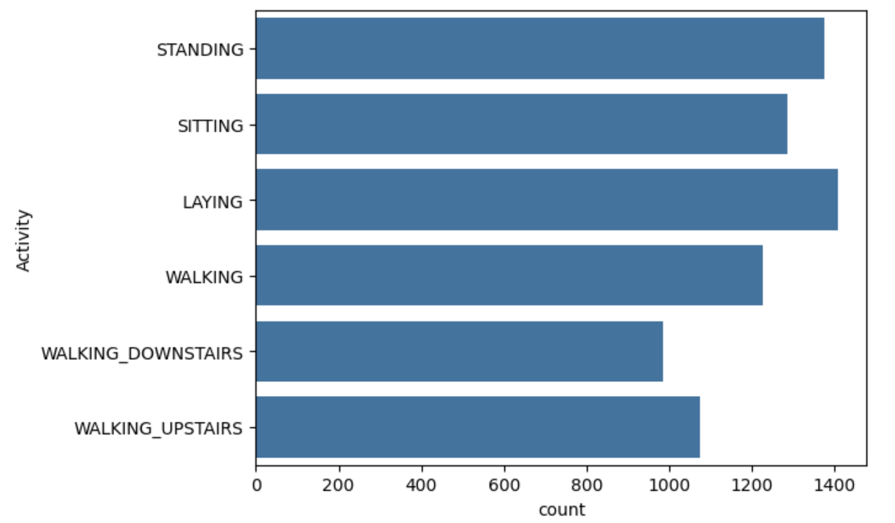
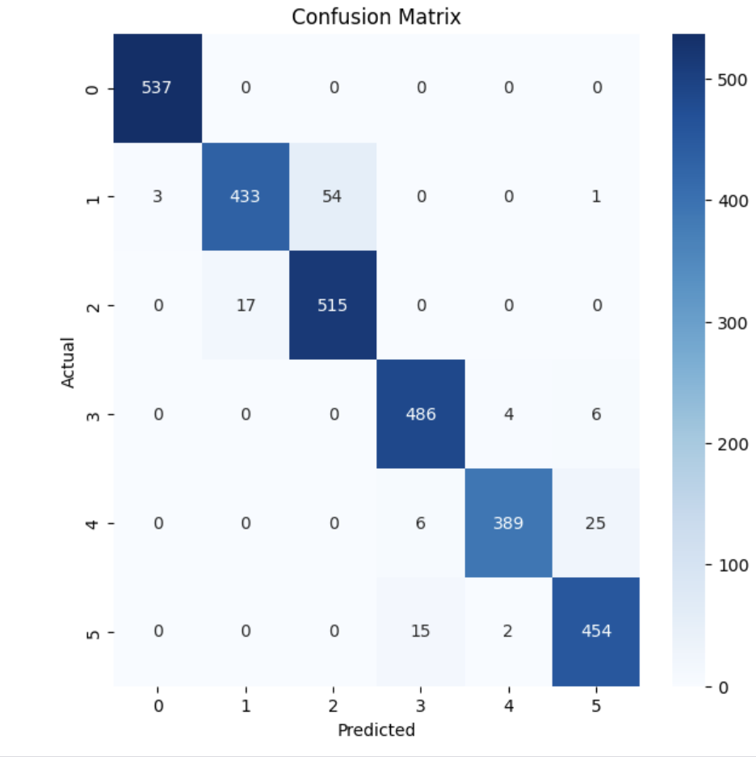
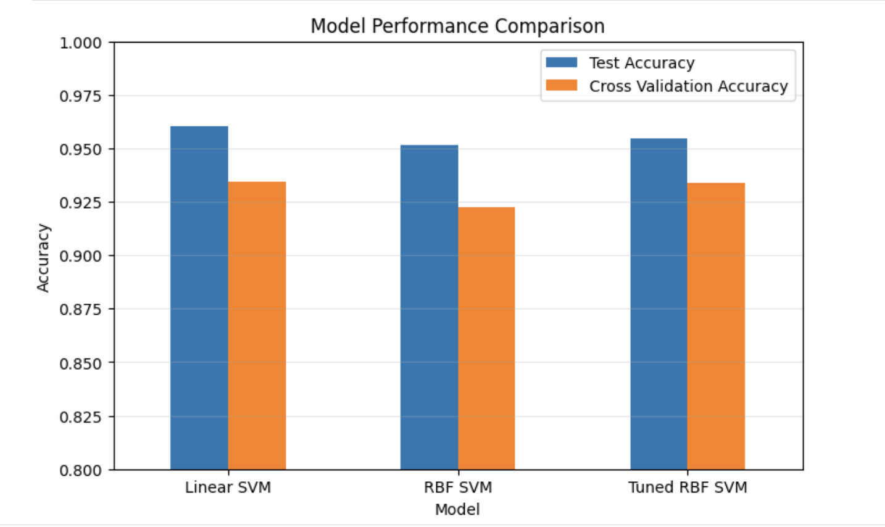

# 🚶 Human Activity Recognition using Support Vector Machines

## 📌 Overview

This project builds a Human Activity Recognition (HAR) classifier using smartphone sensor measurements from the UCI HAR Dataset.

The objective is to classify six human activities using Support Vector Machines and demonstrate the concepts covered in Chapter 5 of *Hands-On Machine Learning* by Aurélien Géron.

---

## 🧠 Activities

- Walking
- Walking Upstairs
- Walking Downstairs
- Sitting
- Standing
- Laying

---

## 📊 Algorithms Used

- Linear Support Vector Machine
- RBF Kernel SVM
- GridSearchCV
- StandardScaler
- Cross Validation

---

## 📁 Dataset

- Human Activity Recognition Using Smartphones Dataset
- 561 sensor features
- 6 activity classes

---

## 🚀 Workflow

1. Data Loading
2. Exploratory Data Analysis
3. Feature Scaling
4. Linear SVM
5. Model Evaluation
6. RBF Kernel SVM
7. Hyperparameter Tuning using GridSearchCV
8. Error Analysis
9. Model Comparison

---

## 📈 Results

| Model | Test Accuracy | Cross Validation Accuracy |
|--------|--------------:|--------------------------:|
| Linear SVM | XX.XX% | XX.XX% |
| RBF Kernel SVM | XX.XX% | XX.XX% |
| Tuned RBF SVM | XX.XX% | XX.XX% |

---

## 📷 Visualizations

### Activity Distribution

### Confusion Matrix

### Model Comparison

---

## 🛠️ Technologies Used

- Python
- NumPy
- Pandas
- Matplotlib
- Seaborn
- Scikit-learn

---

## 🎯 Concepts Demonstrated

- Support Vector Machines
- Linear SVM
- RBF Kernel
- Feature Scaling
- Cross Validation
- Hyperparameter Tuning
- GridSearchCV
- Confusion Matrix
- Model Comparison

---

## 📚 Reference

Aurélien Géron

*Hands-On Machine Learning with Scikit-Learn, Keras & TensorFlow*
